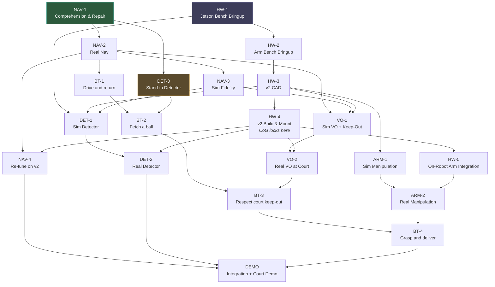
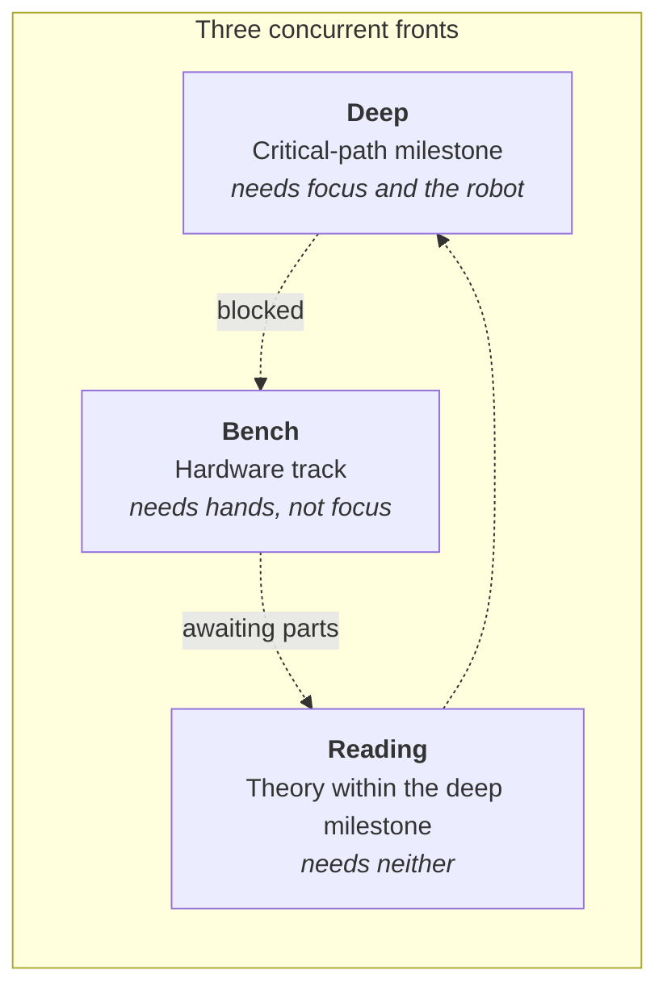
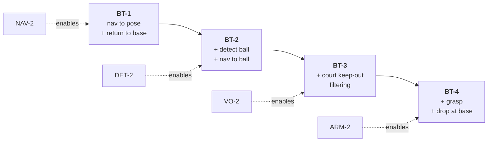

# BallBot v2 Roadmap

Milestone structure for the v2 program: a differential-drive robot with an onboard arm that navigates
indoors by lidar, localizes outdoors against pickleball-court geometry, detects and retrieves balls.

**Companion doc**: [`ARCHITECTURE.md`](./ARCHITECTURE.md) — source of truth for system structure.
This doc is the source of truth for sequencing.

---

## 1. Scope of this document

| | Holds | Changes when |
|---|---|---|
| **GitHub Issues / Milestones** | Issue text, open/closed state, milestone membership | Work happens |
| **This doc** | Track structure, dependency edges, goals, exit criteria | A sequencing decision is made |

This doc carries no status markers and no issue enumerations, so progress never requires a doc edit.
Issue-level detail lives in [GitHub Milestones](https://github.com/atticusrussell/ballbot/milestones);
working conventions live in [`CONTRIBUTING.md`](../CONTRIBUTING.md).

---

## 2. Principles

1. **Milestones carry ordered issue lists.** Work is pulled from the top; selection is not part of
   the task.

2. **Dependencies are modelled as they are, not as convenient.** Where a real dependency serialises
   the graph, it is drawn. Scope is not bent to manufacture parallelism.

3. **Parallel fronts are used where they exist.** Deep work, bench work, and reading run concurrently
   when the graph allows it.

4. **Sequence by what falsifies cheapest.** Bench bringup precedes CAD, because a bench reveals cable
   routing and connector reality before plate geometry is committed.

5. **Simulator fidelity is established against real data, never assumed.** Tuning against an
   unvalidated simulator produces parameters for a robot that does not exist.

6. **Theory attaches to the milestone that consumes it.**

---

## 3. Dependency graph

NAV and HW are independent tracks, each with an unblocked entry point. NAV runs on the existing robot;
HW-1 and HW-2 are bench work requiring neither chassis nor CAD.

Simulation work downstream of HW-3 is gated on the v2 sensor and arm frames in the URDF rather than on
the full CAD milestone. Plate cutouts and mounting hardware do not affect it, so that subset can be
delivered early if the rest of CAD runs long.

DET-0 exists so that autonomy is not gated on model training. The behavior tree subscribes only to
`/pickleball/poses` and cannot tell which detector produced them, so the existing colour-blob tracker
can drive it once it conforms to the contract. This puts a complete fetch loop within reach on the
current robot, rather than only after the v2 build. DET-2 carries the re-validation of that tree
against the trained detector.

---

## 4. Working the stack

A milestone becomes available when every inbound edge in the dependency graph is closed. When a front
stalls — a part on order, a battery charging, a concept that has not landed — switch fronts rather than
pushing.

---

## 5. Milestones

### NAV — Navigation

Runs on the current robot. Per the baseline node graph in ARCHITECTURE.md, nav adds no new nodes — the
entire track is configuration, mapping, and tuning.

| ID | Goal | Exit criterion |
|---|---|---|
| **NAV-1** | Understand and repair the existing nav stack before tuning it | Live node graph and TF tree verified against the baseline diagrams in ARCHITECTURE.md; `navigation.yaml` annotated parameter by parameter; DDS configuration reconciled; saved maps triaged; one goal executes end to end |
| **NAV-2** | nav2 and AMCL reliable in the apartment | ≥9/10 RViz goals succeed; bag files recorded for NAV-3 |
| **NAV-3** | Establish simulator fidelity | Sim base dynamics, lidar noise, and IMU noise reconciled against NAV-2 bags; error bounds documented |
| **NAV-4** | Restore nav performance after v2 changes mass distribution, footprint, and compute | ≥9/10 apartment goals post-build, running on the Orin |

Localization survives the v2 upgrade unchanged — same wheelbase, encoders, IMU, and base firmware.
Control does not: mass distribution, footprint, and control-loop timing all shift. NAV-4 absorbs that.

### HW — v2 Hardware

| ID | Goal | Exit criterion |
|---|---|---|
| **HW-1** | Jetson Orin Nano Super running the ROS workspace on a desk | All packages build; rpicam3 publishes over CSI; camera intrinsics captured |
| **HW-2** | Arm alive on the bench, driven from the Jetson | Joints respond to ROS commands; servos calibrated; eye-in-hand camera mounted and hand-eye calibrated; commanded Cartesian pose reached |
| **HW-3** | v2 CAD and model: top plate, arm mount, Jetson footprint, sensor placement | Vendor arm URDF composed into the BallBot URDF; v2 URDF spawns in Gazebo without self-collision; estimated inertia and CoG sane |
| **HW-4** | Robot assembled in v2 configuration | Jetson mounted and powered; arm bolted to top plate; measured CoG checked against the HW-3 estimate |
| **HW-5** | Arm integrated on the robot rather than the bench | Reachable workspace from the mounted position verified against URDF, including floor reach |

HW-2 runs against the vendor-supplied arm URDF standalone, which is sufficient for servo calibration
and Cartesian commands. Composing that arm into the BallBot URDF belongs to HW-3, since a v2 model that
spawns without self-collision necessarily contains the arm.

Hand-eye calibration sits in HW-2 because it relates the gripper to the eye-in-hand camera — arm-local,
and unaffected by mounting the arm to the chassis.

CoG is checked twice: estimated from CAD in HW-3, measured after assembly in HW-4. The measurement is
what determines the scope of NAV-4.

### DET — Detector

| ID | Goal | Exit criterion |
|---|---|---|
| **DET-0** | Existing colour-blob tracker conforms to the detection contract | `ball_tracker` publishes `/pickleball/detections` and `/pickleball/poses`; a ball at a surveyed position projects to within a documented tolerance |
| **DET-1** | YOLO detector trained on synthetic data | Sim camera model reconciled against real rpicam3 intrinsics; ≥90% mAP on held-out synthetic test set |
| **DET-2** | Detector deployed on the Orin | ≥30 fps on Orin; ≥90% precision at 0.5–3 m indoors; behavior tree re-validated against the trained detector in place of the stand-in |

`ball_tracker` is retained permanently rather than replaced. Beyond DET-0's stand-in role it remains a
fallback when inference is unavailable and a tuning aid. Ground-plane projection already exists in its
`detect_ball_3d` node, so `detection_projector` is a port to the message contract rather than new work.

Synthetic training data is only useful once the simulated camera matches the physical one in both
respects: intrinsics — field of view and distortion — come from the sensor itself in HW-1, while
extrinsics — mount height, pitch, and optical-centre placement — are fixed by CAD in HW-3. The arm also
enters the chassis camera's field of view, so its geometry must be present in sim before training
frames are captured.

### VO — Visual Odometry

| ID | Goal | Exit criterion |
|---|---|---|
| **VO-1** | Court-line VO in simulation, keep-out costmap working | <10 cm pose error over 20 m sim traversal; nav2 respects the keep-out polygon |
| **VO-2** | VO on a real court | <30 cm drift over court length; court polygon published in the `map` frame |

VO is independent of the ball detector — line detection, geometry matching, and PnP share only a camera
with it. VO-1 depends on nav because it publishes a costmap filter that nav2 must respect, and on HW-3
because PnP recovers camera pose, which is only useful as robot pose once camera extrinsics are fixed.
The keep-out costmap work is unaffected by either and can proceed ahead of the VO work.

### ARM — Manipulation

| ID | Goal | Exit criterion |
|---|---|---|
| **ARM-1** | Visual servoing grasp in simulation, arm mounted on the robot | ≥80% grasp success over 50 random-pose balls on the floor |
| **ARM-2** | Real arm grasps a real pickleball | ≥80% over 50 bench attempts; grasp exposed as an action server |

ARM-1 depends on HW-3 because mount geometry is central to the grasp problem, not incidental to it:
whether the arm can reach the floor from the top plate, and what the eye-in-hand camera sees on
approach, are both set by where the arm sits. A fixed-base result would not transfer. HW-5 verifies the
same reach on the physical robot.

### DEMO — Final Integration

| ID | Goal | Exit criterion |
|---|---|---|
| **DEMO** | End-to-end ball retrieval at a real court | ≥3 balls retrieved; demo video captured; write-up published |

### BT — Autonomy

The behavior tree lives in its own package, `ballbot_behavior`, and is extended once by each capability
track. Keeping it separate means a capability milestone closes on whether the capability works, not on
whether the autonomy layer has been wired to it.

| ID | Goal | Exit criterion |
|---|---|---|
| **BT-1** | Drive to a pose and come home | Nav to hardcoded pose, return to base, handle nav failure; 5 successful cycles |
| **BT-2** | Fetch a ball | Wait for detection, select nearest ball, nav to approach pose, return; 5 successful cycles |
| **BT-3** | Respect the court boundary | Balls inside the court polygon filtered out before selection; 3 successful cycles at the boundary |
| **BT-4** | Grasp and deliver | Grasp on arrival, drop at base; 3 successful pickup-and-drop cycles |

Each stage is additive — BT-2 is BT-1 plus a detection subtree, and so on. Keep-out is enforced twice
by design: at the planner through the nav2 costmap filter, and at the tree through ball filtering.

Failure-handling decorators — retry, timeout, give-up — are added across the whole tree in DEMO.

---

## 6. Theory

Theory issues belong to the milestone whose work they unblock, and carry the `theory` label for
filtering. Reading is pulled immediately before the implementation issue that consumes it, so it lands
against something concrete, and it supplies a low-energy task when the bench and the robot are both
unavailable.

| Track | Subject |
|---|---|
| **NAV-1** | Linear algebra; probability and covariance; rotations and frames — quaternions, DCM, NED/ENU |
| **NAV-2** | Kalman and extended Kalman filters; particle filters and Monte Carlo localization; pose-graph SLAM |
| **DET-1** | Image formation and camera models; convolutional networks; OpenCV |
| **VO-1** | Multi-view geometry and PnP; feature detection, optical flow, Hough transforms |
| **ARM-1** | Kinematics and inverse kinematics; MoveIt2; PID and servo control |

---

## 7. Reading

### Foundations

- 3Blue1Brown — *Essence of Linear Algebra*
- StatQuest — probability, covariance, and covariance-matrix geometry
- Thrun, Burgard, Fox — *Probabilistic Robotics*, ch. 3–4 (Gaussian and nonparametric filters)

### Localization and filtering — NAV

- MATLAB Tech Talks — *Understanding Kalman Filters*
- MATLAB Tech Talks — *Understanding Sensor Fusion and Tracking*
- Thrun, Burgard, Fox — *Probabilistic Robotics*, ch. 8 (Monte Carlo localization)
- Stachniss — [Mobile Robotics online training](https://www.ipb.uni-bonn.de/online-training-robotics/index.html):
  Bayes filter through particle filter and MCL

### Pose-graph SLAM — NAV

`slam_toolbox` is a pose-graph SLAM system: a Karto-derived correlative scan matcher on the front end,
feeding a pluggable least-squares backend that defaults to Ceres, with Sparse Pose Adjustment and g2o
available as alternative solver plugins. This is a different algorithm family from the particle-filter
material above, and is not covered by it.

Start here, in order:

1. Burgard, Grisetti, Stachniss — [*Graph-based SLAM in 20 Minutes*](https://www.youtube.com/watch?v=Alu59K8zvYs)
   — orientation before committing to the tutorial paper.
2. Grisetti, Kümmerle, Stachniss, Burgard — *A Tutorial on Graph-Based SLAM*,
   [*IEEE Intelligent Transportation Systems Magazine*](https://doi.org/10.1109/MITS.2010.939925)
   2(4):31–43, 2010. The canonical treatment; front-end/back-end split and least-squares error
   minimization.
3. Stachniss — [*Graph-based SLAM using Pose Graphs*](https://www.youtube.com/watch?v=uHbRKvD8TWg),
   with [slides](https://www.ipb.uni-bonn.de/html/teaching/msr2-2020/sse2-05-graph-slam.pdf).
4. Stachniss — [*Robust Least Squares for Graph-Based SLAM*](https://www.youtube.com/watch?v=z60RbiY18I8)
   — why loop closures fail and how robust kernels handle outliers.
5. Thrun, Burgard, Fox — *Probabilistic Robotics*, ch. 11 (GraphSLAM) — the textbook derivation.

Implementation-specific, once the theory is in place:

- Macenski, Jambrecic — *SLAM Toolbox: SLAM for the dynamic world*,
  [*JOSS*](https://joss.theoj.org/papers/10.21105/joss.02783.pdf) 6(61), 2021 — the package's own
  design paper.
- Olson — [*Real-Time Correlative Scan Matching*](https://april.eecs.umich.edu/pdfs/olson2009icra.pdf),
  ICRA 2009 — the front-end scan matcher lineage.
- Konolige et al. — *Efficient Sparse Pose Adjustment for 2D Mapping*, IROS 2010 — the SPA backend that
  Karto shipped and that `slam_toolbox` retains as a solver plugin.
- [`slam_toolbox` README](https://github.com/SteveMacenski/slam_toolbox) — solver plugin configuration
  and lifelong-mapping modes.

### Perception — DET

- Welch Labs — *Learning to See*; *Neural Networks Demystified*
- 3Blue1Brown — *Neural Networks*, ch. 1–4
- First Principles of Computer Vision — image formation and camera models
- DOFBOT-SE course 07 (OpenCV) and course 08 (AI vision basics)

### Multi-view geometry — VO

- Hartley, Zisserman — *Multiple View Geometry*, PnP chapter
- Szeliski — *Computer Vision: Algorithms and Applications* — features and structure from motion
- First Principles of Computer Vision — features, optical flow, calibration, pose estimation
- Stachniss — *Mobile Sensing and Robotics 2*
- DOFBOT-SE course 12 — Hough lines, edges, contours, feature tracking, optical flow

### Manipulation — ARM

- Lynch, Park — *Modern Robotics*, book and lecture series
- DOFBOT-Pro Orin-Super MoveIt case study, 10 chapters
- DOFBOT-Pro Orin-Super ROS 2 URDF model chapter
- DOFBOT-Pro course 11 — 3D arm control and inverse kinematics
- DOFBOT-SE course 06 — basic servo control; course 09 ch. 1 — PID fundamentals

### Source notes

DOFBOT-SE tutorials (`docs/third_party/dofbot-se/`) are ROS 1 — useful for fundamentals, less so for
ROS 2 specifics. DOFBOT-Pro tutorials (`docs/third_party/dofbot-pro/`) include ROS 2 native material
under `23.For_JetsonORIN_SUPER_JetPack6.2/`, and are preferred wherever chapters overlap. Vendor source
code lives under `third_party/`, separate from documentation.

---

## 8. Conventions

Track IDs are identifiers, not sequence. The dependency graph is the authority on ordering.

Issue, branch, and tagging conventions live in [`CONTRIBUTING.md`](../CONTRIBUTING.md).
